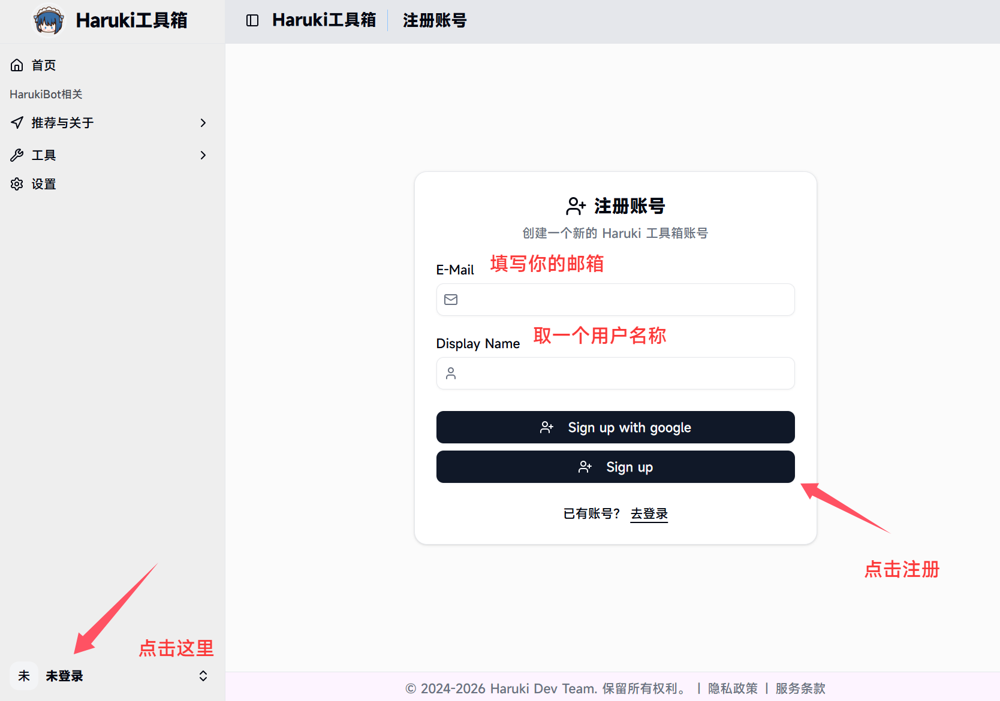
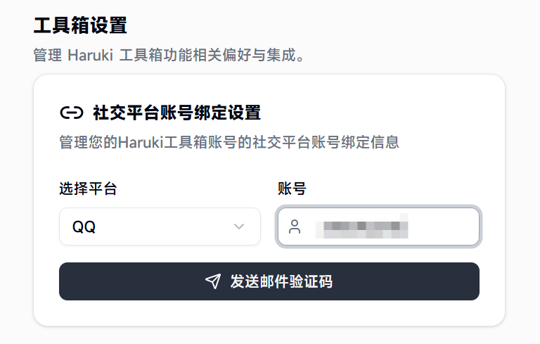
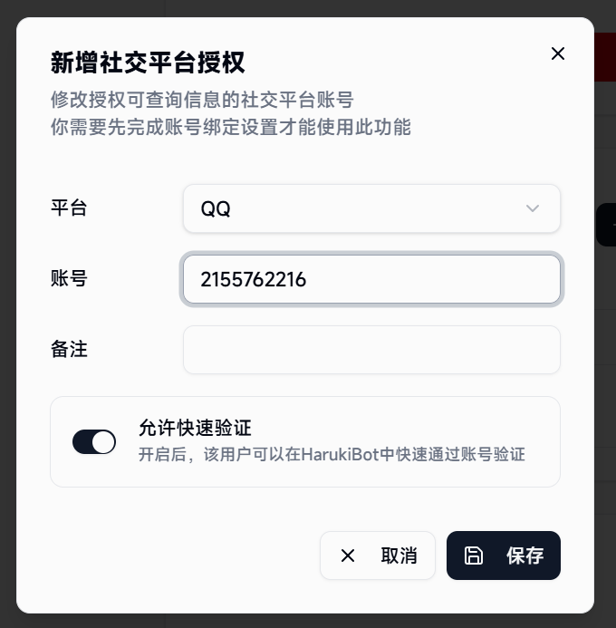
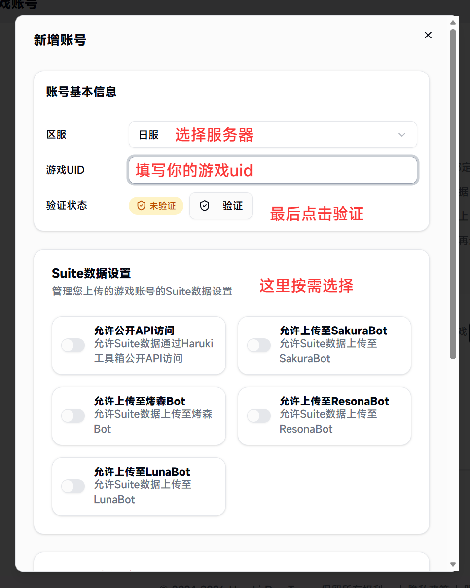
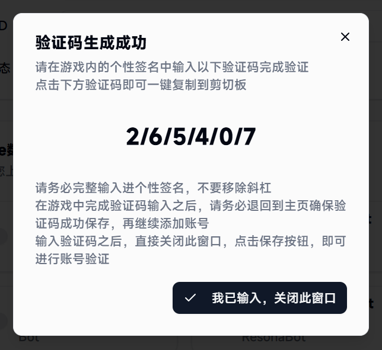
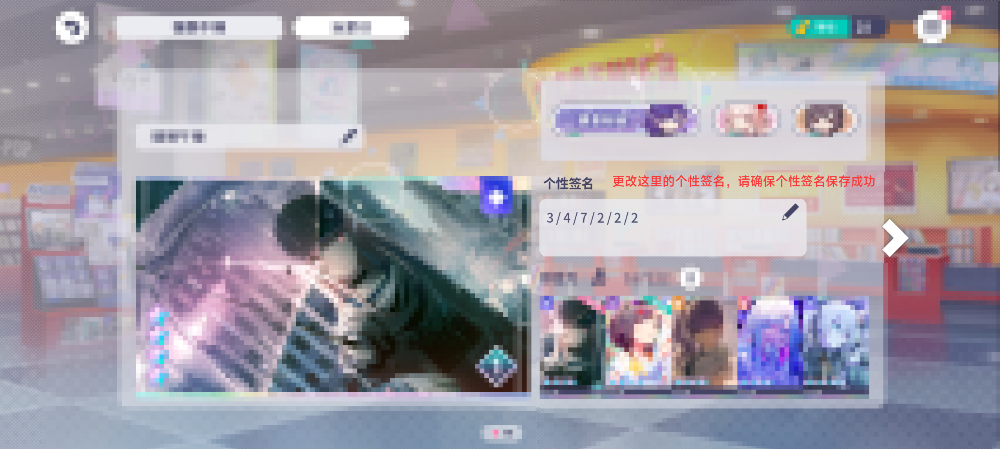
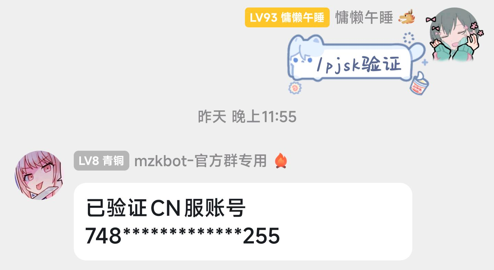

# Haruki工具箱账号验证教程

## 注册账号

打开[Haruki工具箱(点我进入)](https://haruki.seiunx.com/)，如图所示注册账号，期间会向你的邮箱发送验证码。

---

## 绑定QQ

在Haruki工具箱首页，点击 **账号与设置** → **账号设置** 按钮，如图所示绑定账号。

在 **社交平台账号绑定设置** 中，填写你使用mzkbot的QQ号并点击发送邮件验证码。

在下方的 **授权社交平台查询** 中，点击 **新增授权**，如图所示新增授权。

在弹出的弹窗中，请填写你使用mzkbot的QQ号，**并点击允许快速验证**。

---

## 绑定游戏账号

返回Haruki工具箱首页，点击 **账号与设置** → **绑定游戏账号** 按钮。

请在游戏内的个性签名中输入以下验证码完成验证。点击下方验证码即可一键复制到剪切板。

::: warning 注意
请务必完整输入进个性签名，不要移除斜杠。在游戏中完成验证码输入之后，请务必退回到主页确保验证码成功保存，再继续添加账号。输入验证码之后，直接关闭此窗口，点击保存按钮，即可进行账号验证。
:::

点击最下角的 **保存按钮**，即可完成游戏账号绑定。

---

## 账号验证

返回QQ，在有HarukiBot NEO的群聊中，输入指令 `/pjsk验证` 即可完成账号验证。

