# HarukiProxy-Android 教程

::: danger 阅读前警告
当前HarukiProxy的发布版本为 `v2.1.0`，本文档的介绍以及教程均根据 `v2.0.0` 以上版本编写。

如果你目前使用的版本低于v2.0.0，并且希望使用v2.0.0以后续版本，则更新到v2.0.0以上版本时，需要先 [卸载旧版的HarukiProxy-Android](#卸载harukiproxy-android)。

然后 [修改harukiproxy.sh的代码](#编辑harukiproxy脚本)。

如果你是PC端模拟器用户，请转至 [HarukiProxy教程](./index.md)
:::

::: info 特别鸣谢
开发者: [Haruki Dev Team](https://github.com/Team-Haruki)  
教程编写者: `storyxy3`、`Deseer`、`Aposetles`、`Lemoe` 和 `LQ`
:::

## 什么是HarukiProxy

HarukiProxy是由 [Haruki Dev Team](https://github.com/Team-Haruki) 开发的一款Android平台**半自动**抓取游戏pjsk的数据的程序。

## HarukiProxy的特点

- 支持 `国服`、`日服`、`台服`、`韩服`、`国际服` 数据抓取
- 支持**自动上传数据**到Haruki工具箱
- 支持选择是否公开自己自动上传到Haruki工具箱的数据在公开API访问
- 支持自定义上传数据端点 (需第三方服务支持)
- 支持保存抓取的数据到本地
- 支持保存抓取的suite数据到本地
- 支持保存抓取的mysekai数据到本地
- 支持自动为Android设备设置HarukiProxy为代理
- 支持自定义上游HTTP代理

## 初期准备

::: danger 阅读前注意
**本程序只能在获取root权限的Android设备上运行，现在大部分的Android设备无法轻易获取root权限，所以本教程在Android设备上的Android虚拟机来运行本程序**

**Android原生的终端缺少本教程所用到的一些国内，所以本教程使用MT管理器来启动本程序**

**由于不可抗力，本程序不能抓取国服的MySekai数据**
:::

::: tip 提醒
配置出现问题时请跳转至 [问题自查](#问题自查)

先查找是否为常见问题，再借助搜素引擎和ai尝试解决问题，最后再在群聊里问群友，不会提问的请务必先阅读 [提问的智慧](https://github.com/ryanhanwu/How-To-Ask-Questions-The-Smart-Way/blob/main/README-zh_CN.md)
:::

- 需要在Android手机上安装Android虚拟机，本教程使用 [光速虚拟机](https://vphoneos.com/)
- 需要在虚拟机中安装 [MT管理器](https://mt2.cn/)，也可以使用其他的方式来运行本程序，请自行设置。

## 虚拟机设置

下载并安装好光速虚拟机之后，启动光速虚拟机，这个应用有广告。它会要求你关掉安卓子进程限制，按照它的教程操作就好。如果不关掉的话，虚拟机无法正常运行，会被本机杀掉。

::: tip 注意
安卓12、13的华为、荣耀系统必须用电脑才能解锁子进程限制
:::

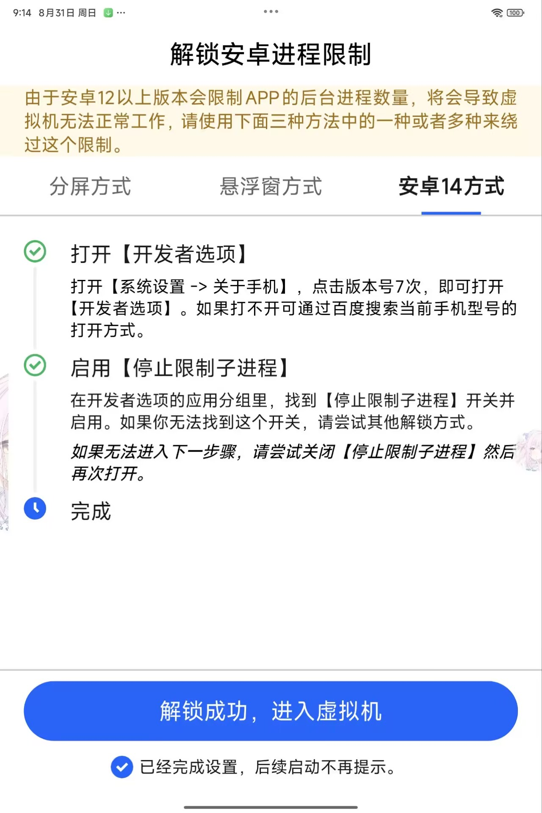

新建虚拟机，使用免费的安卓7和32+64位就好。

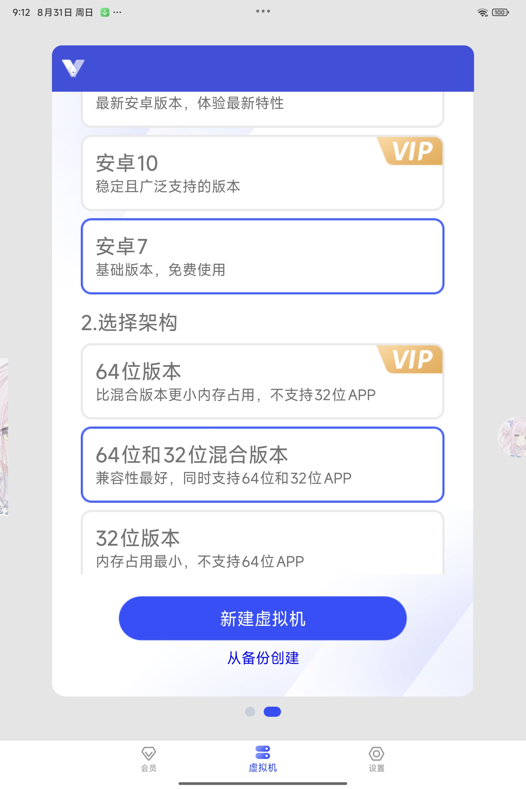

然后启动你的虚拟机，它会请求一些权限，有些权限不同意可能无法启动。第一次启动会花一分钟左右的时间，耐心等待。启动成功后来到虚拟机的桌面，点击右下角的 `导入导出`，点击 `导入`。必须同意 `获取已安装应用的权限`，才能把本机上的pjsk导入到虚拟机，如果你在本机上安装了MT管理器也一并导入。


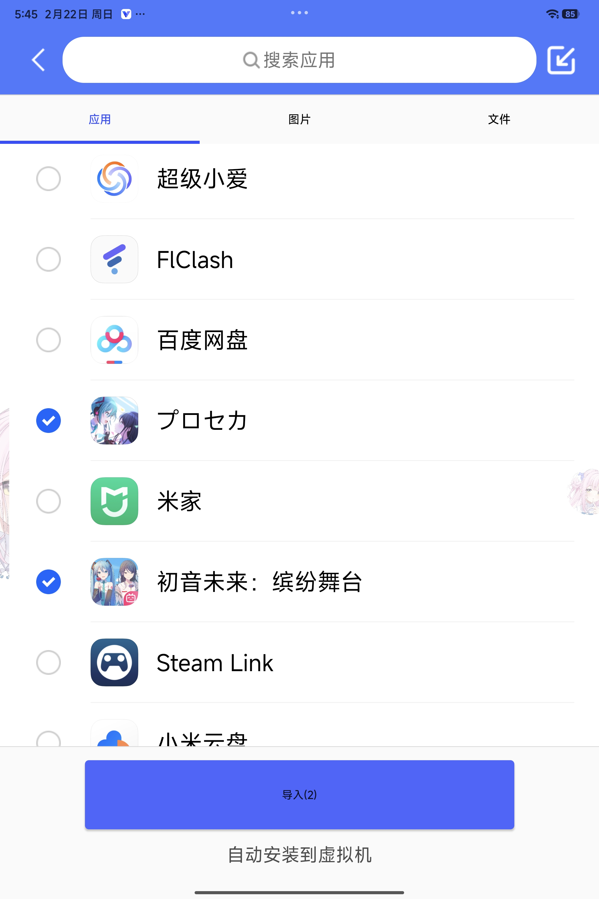

::: tip 提示
导入的应用会自动安装，导入的文件会放在虚拟机的/sdcard/Documents文件夹里。

如果你不想提供权限，也可以用虚拟机内自带的VIA浏览器下载游戏和MT管理器
:::

等待安装完毕后回到桌面，上滑，显示所有应用。能看到游戏和MT管理器，你可以长按应用程序的图标将它们添加到主页。

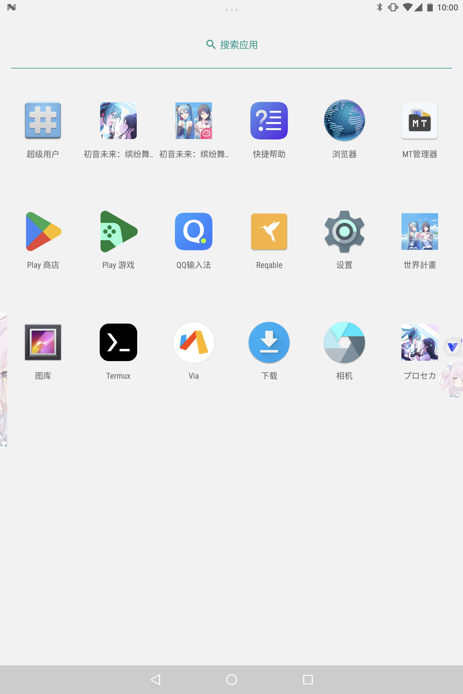

## HarukiProxy-Android设置

如果你没有把应用添加到主页，上滑，查看所有应用。启动MT管理器，同意它的用户协议和权限，然后不用登录。点击下方的 `+`，输入文件名 `harukiproxy.sh`，点击 `文件` 来新建一个shell脚本文件。

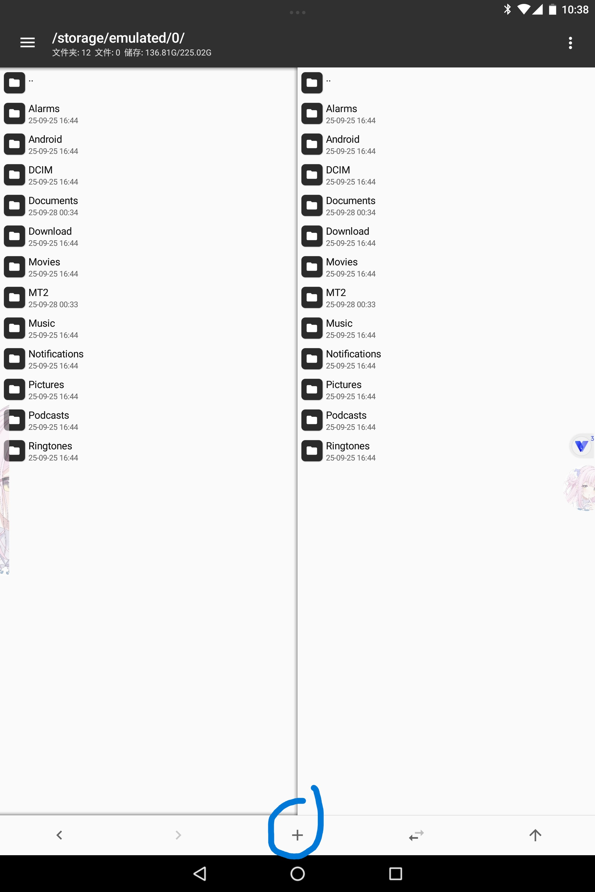
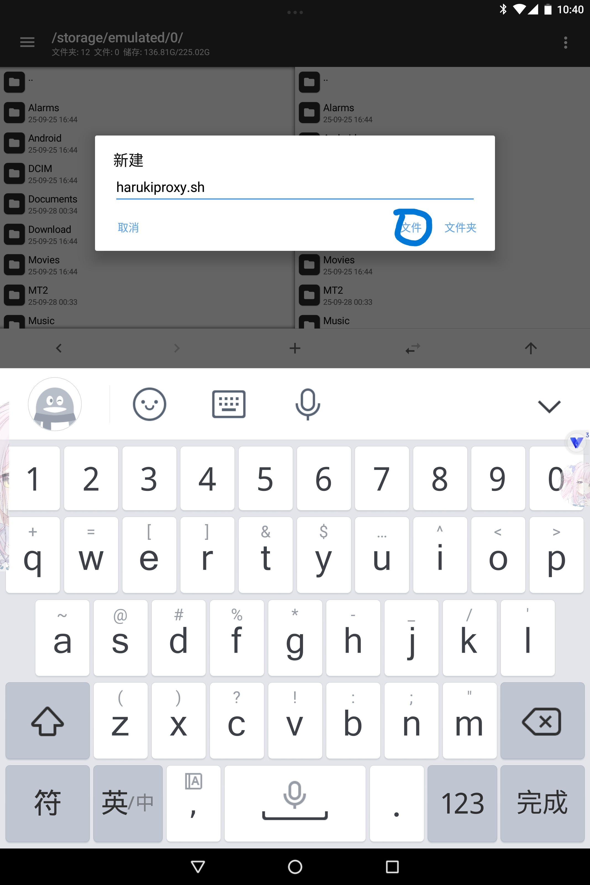

### 编辑harukiproxy脚本

点击 `harukiproxy.sh` 文件，选择 `编辑`。然后输入以下代码：

```shell
#!/bin/sh

# Check if running as root
if [ "$(id -u)" -ne 0 ]; then
    if command -v su >/dev/null 2>&1; then
        exec su -c "$0 $*"
    elif command -v sudo >/dev/null 2>&1; then
        exec sudo "$0" "$@"
    else
        echo "This script must be run as root." >&2
        exit 1
    fi
fi

ROOT_DIR="/data/local/tmp/harukiproxy"

# Ensure root_dir exists
if [ ! -d $ROOT_DIR ]; then
    mkdir -p $ROOT_DIR
fi

BIN_NAME="HarukiProxy-v2.1.0-android-arm64"
BIN_PATH="$ROOT_DIR/$BIN_NAME"
CONFIG_PATH="$ROOT_DIR/config-android.yaml"

# Download binary if not exists
if [ ! -f "$BIN_PATH" ]; then
    curl -L -o "$BIN_PATH" "https://docs.haruki.seiunx.com/download/HarukiProxy/${BIN_NAME}/haruki-proxy-android"
    chmod 0755 "$BIN_PATH"
fi

# Download config if not exists
if [ ! -f "$CONFIG_PATH" ]; then
    curl -L -o "$CONFIG_PATH" "https://docs.haruki.seiunx.com/download/HarukiProxy/config-android.yaml"
    chmod 0755 "$CONFIG_PATH"
fi

su2 -c "sh -s $ROOT_DIR $BIN_NAME" <<'EOF'
# Run the binary from its directory without -c argument
cd $1 && exec ./$2
EOF
```

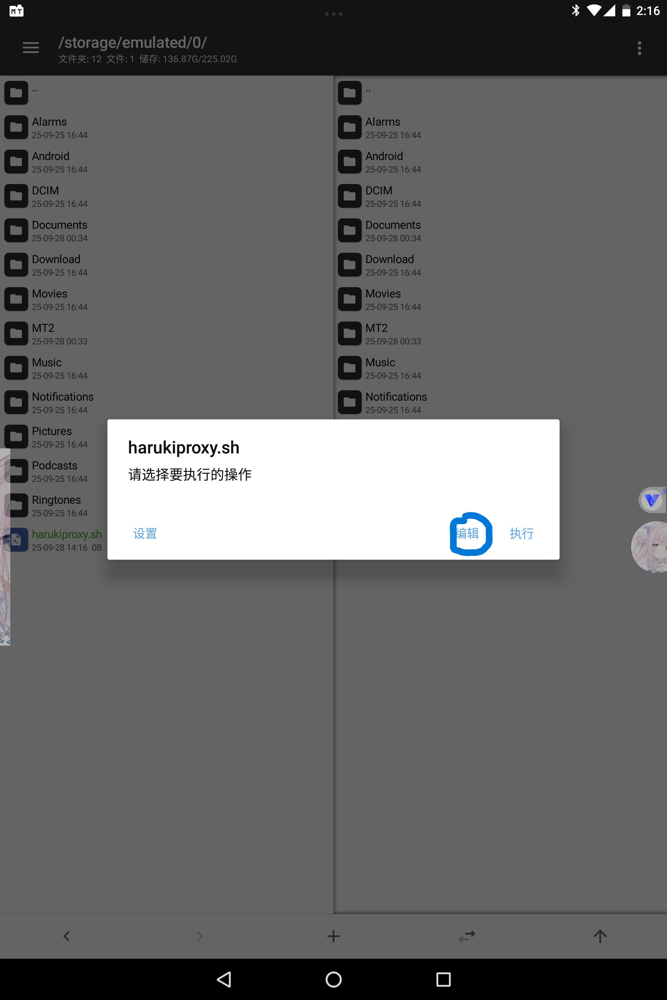
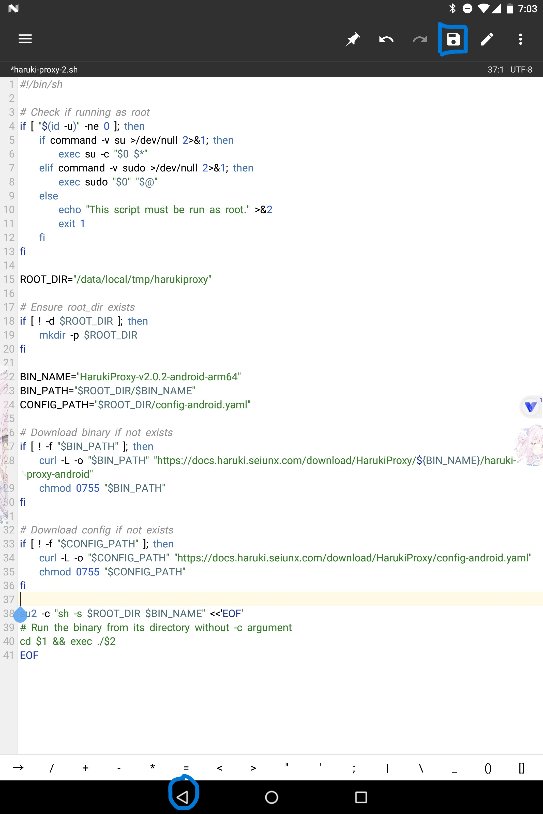

点击右上角的保存，然后点击下方的 `◁` 回到MT管理器。再次点击harukiproxy.sh，点开 `设置`，选择 `使用扩展包环境执行`，并勾选 `使用ROOT权限执行`，然后点击执行。

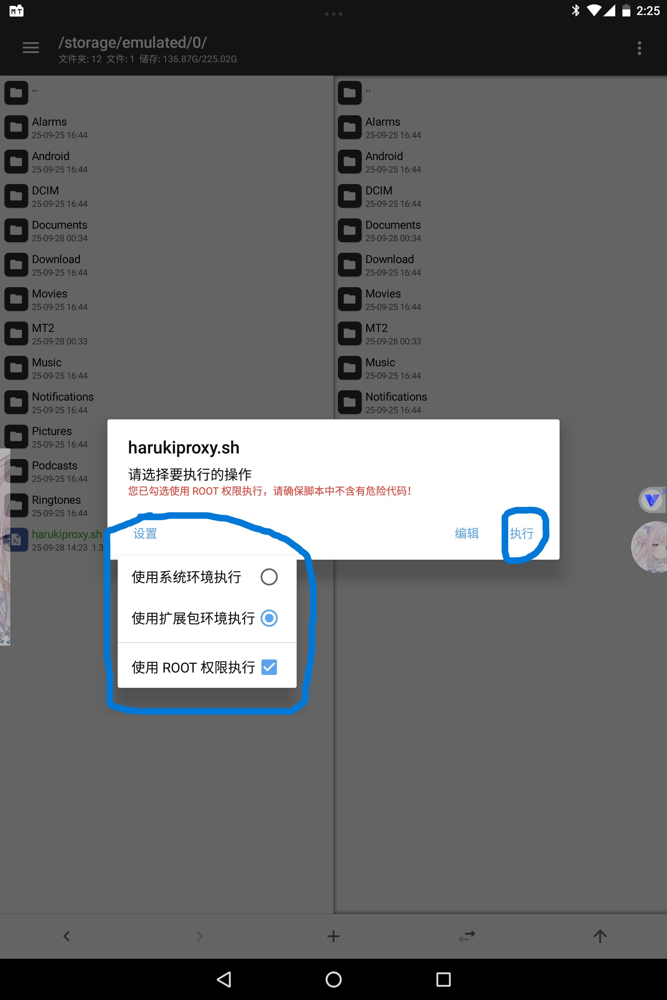

::: tip 提示
第一次使用时，它会让你下载终端扩展包

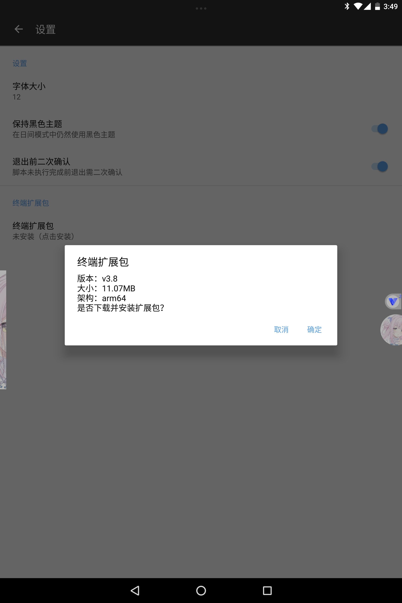

等待下载完毕后，按下 `◁` 返回，开始执行脚本
:::

脚本会自动下载所需的软件和配置文件，请保持网络通畅。它会自动完成相应配置，安装证书并自动重启。

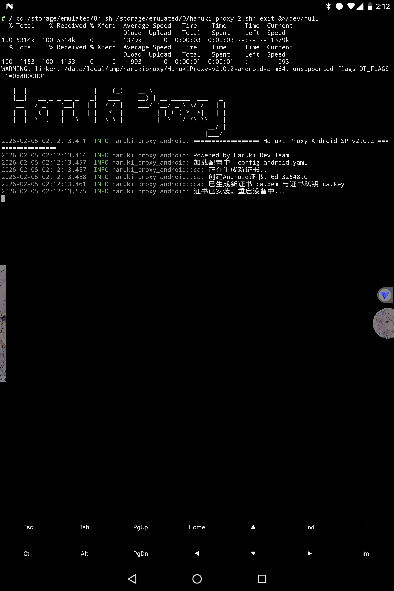

## 开始抓包

打开MT管理器，点击harukiproxy.sh，点击执行。如果前面的操作正确，那么它就会自动设置代理并开启抓包。当显示 `启动HarukiProxy-Android: 0.0.0.0:8888` 时，就说明执行成功了。


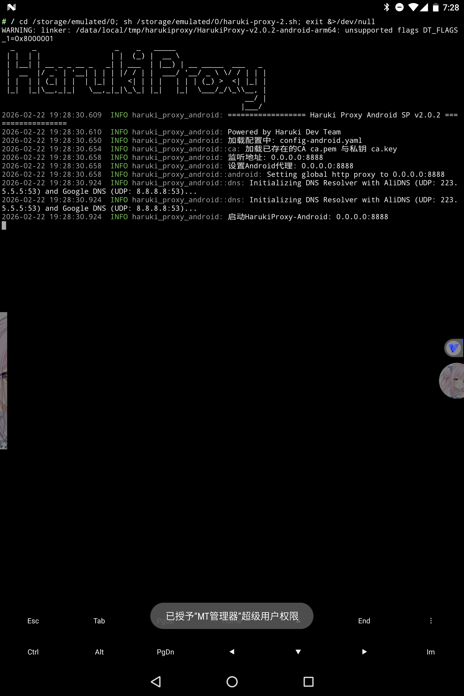

::: danger 注意
不要直接按两下 `◁` 退出，这会将脚本关闭，可以按 `◯` 或 `▢` 回到桌面再打开游戏。

如果你在执行后出现下面的 `代理捕获到错误: io error`，显示 `[进程已结束]`。可能是之前运行的脚本没有被正确关闭导致的，请 [关闭harukiproxy](#关闭harukiproxy-android)。

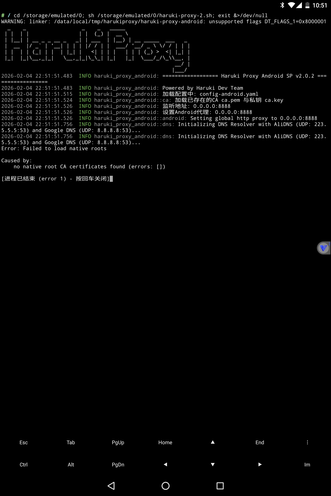
:::

打开虚拟机内的游戏，正常登录自己的账号，等待到这下图一步就好，不用下载游戏数据。


回到MT管理器，你就能找到这样的日志。默认是上传到 [Haruki工具箱](https://haruki.seiunx.com/)，你可以在 [配置](#配置config-android) 中设置 `upload_endpoint` 将抓包数据上传到你设置的端点。为了数据安全，Haruki工具箱需要注册并绑定账号后才能使用。

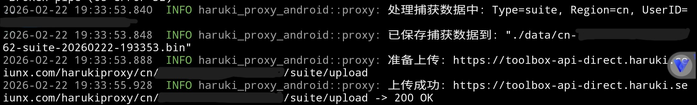

## 关闭HarukiProxy-Android

运行HarukiProxy后，关闭MT管理器也不会关掉HarukiProxy（关机可以，但是不会删除代理设置），需要用命令强行关闭。新建文件 `kill-harukiproxy.sh`，然后输入以下代码：

```shell
#!/bin/sh

pkill -l 2 "HarukiProxy"

su2 <<SETTINGS
settings put global http_proxy :0
settings put global https_proxy :0
SETTINGS
```

保存后同样设置 `使用扩展包环境执行`，并勾选 `使用ROOT权限执行`，然后点击执行。它会关掉HarukiProxy的进程，并且重置代理设置。

## 卸载HarukiProxy-Android

如果你要更新HarukiProxy，那么你必须要先卸载掉旧的。新建文件 `uninstall-harukiproxy.sh`，然后输入以下代码：

```shell
#!/bin/sh

# Check if running as root
if [ "$(id -u)" -ne 0 ]; then
    if command -v su >/dev/null 2>&1; then
        exec su -c "$0 $*"
    elif command -v sudo >/dev/null 2>&1; then
        exec sudo "$0" "$@"
    else
        echo "This script must be run as root." >&2
        exit 1
    fi
fi

ROOT_DIR="/data/local/tmp/harukiproxy"
SYSTEM_CACERTS_DIR="/system/etc/security/cacerts"

#remove resolv.conf
if [ -f /etc/resolv.conf ]; then
    echo "删除/etc/resolv.conf"
    mount -o remount,rw /system
    rm -f /etc/resolv.conf || exit 1
fi

# Ensure root_dir exists
if [ ! -d $ROOT_DIR ]; then
    echo "${ROOT_DIR}不存在"
    exit 0
fi

#remove cacert
find "$ROOT_DIR" -type f -name "*.0" | while read cacert_file; do
    #提取文件名
    file_name=$(basename "$cacert_file")
    system_cacert_file="$SYSTEM_CACERTS_DIR/$file_name"
    if [ -f "$system_cacert_file" ]; then
        echo "删除：$system_cacert_file"
        mount -o remount,rw /system
        rm -f "$system_cacert_file" || exit 1
    fi
done

#remove root_dir
if [ -d $ROOT_DIR ]; then
    echo "删除harukiproxy目录：$ROOT_DIR"
    rm -r -f "$ROOT_DIR" || exit 1
fi

echo "卸载完成"
```

保存后同样设置 `使用扩展包环境执行`，并勾选 `使用ROOT权限执行`，然后点击执行。它会删除 `/etc/resolv.conf` 文件，从系统目录中删除与 `/data/local/tmp/harukiproxy` 文件夹中的.0证书文件同名的证书文件，删掉 `/data/local/tmp/harukiproxy` 文件夹。

## 配置config-android

打开MT管理器，点击左上方的文件夹路径，打开跳转输入框。输入 `/data/local/tmp/harukiproxy`，跳转过去。

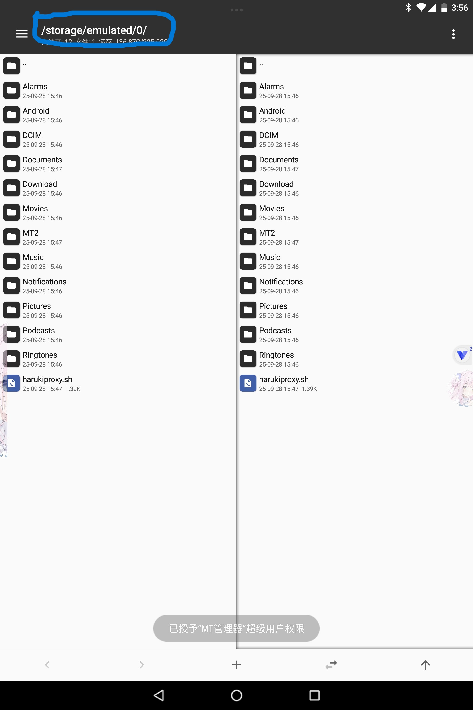
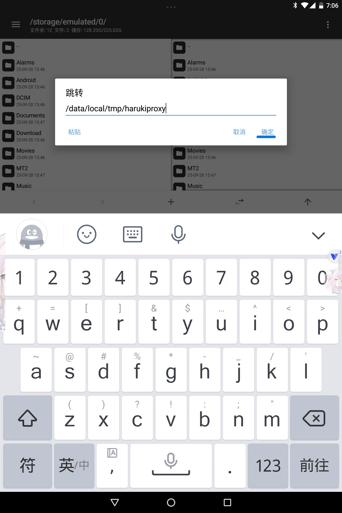

点击打开config-android.yaml文件，请根据注释自行配置。

```yaml
auto_upload: true # 是否自动上传数据到Haruki Toolbox，一般不需要改为false

upload_endpoint: "" # 自定义上传数据端点，不修改则默认上传至haruki toolbox的数据上传端点，你可以修改为想传到的其他端点地址

disable_encryption: false # 自定义上传数据端点需要将这个改为true，否则上传的数据无法解密

upload_secret: "" # 自定义上传端点用的私钥

save_data_locally: false # 是否自动保存数据到本地，如果你有需求可以改为true

save_data_dir: "./data" # 自动保存的数据路径，默认为在HarukiProxy目录下的data文件夹

save_suite_locally: true # 是否自动保存suite数据到本地，如果save_data_locally未启用，则该选项不会生效

save_mysekai_locally: true # 是否自动保存mysekai数据到本地，如果save_data_locally未启用，则该选项不会生效
#这一部分控制你是否将抓取到的数据保存在本地，如果你想要查看自己的suite与mysekai数据，抑或是想要手动上传数据，那么就将 save_data_locally: false改为 true，数据则会自动保存在你HarukiProxy目录下的data目录

listen: "0.0.0.0:8888" # MitM监听，一般情况下无需更改

android_proxy_ip: "" # 手动设置代理IP，如果自动获取IP并设置会导致模拟器/设备无法联网，请填写此项

goproxy_debug: false # 启用调试模式，如果有问题时请改为true，否则保持false即可

goproxy_upstream_proxy: "" # 上游代理，如果连接状况不佳可以设置(如"http://127.0.0.1:6152")，否则留空即可
#如果你不是很清楚上游代理是什么意思，那么不用管了，否则和注释一样，将6152改为你代理软件中的端口号
```

---

## 问题自查

### 程序直接停止

在执行后出现下面的 `代理捕获到错误: io error`，显示 `[进程已结束]`。可能是之前运行的脚本没有被正确关闭导致的，请 [关闭HarukiProxy-Android](#关闭HarukiProxy-Android)。


### 启动了程序但是无法联网

#### 可能是错误的点击返回导致程序被关闭

这种情况下，如果直接运行脚本会出现上面的 [程序直接停止](#程序直接停止) 的错误，需要先 [关闭HarukiProxy-Android](#关闭HarukiProxy-Android)。

不要直接按两下 `◁` 退出，这会将脚本关闭，可以按 `◯` 或 `▢` 回到桌面再打开游戏。

#### 可能是默认配置ip失效

检查 [配置文件](#配置config-android) 中下面这一项设置：

```yaml
android_proxy_ip: "" # 手动设置代理IP，如果自动获取IP并设置会导致模拟器/设备无法联网，请填写此项
```

尝试填写 `127.0.0.1`。

### 没有启动程序但是无法联网

如果在程序运行中直接按两下 `◁` 退出、关闭MT管理器或关闭虚拟机。这样都会导致程序的运行直接中断，无法清理代理设置，可以通过执行 [关闭HarukiProxy-Android](#关闭harukiproxy-android) 脚本来重置代理设置。
