# HarukiProxy 介绍与教程

::: danger 阅读前警告
当前HarukiProxy的发布版本为 `v2.1.0`，本文档的介绍以及教程均根据 `v2.0.0` 以上版本编写。

如果你目前使用的版本低于v2.0.0，并且希望使用v2.0.0以后续版本，则更新到v2.0.0以上版本时，需要先删除先前版本的证书文件。

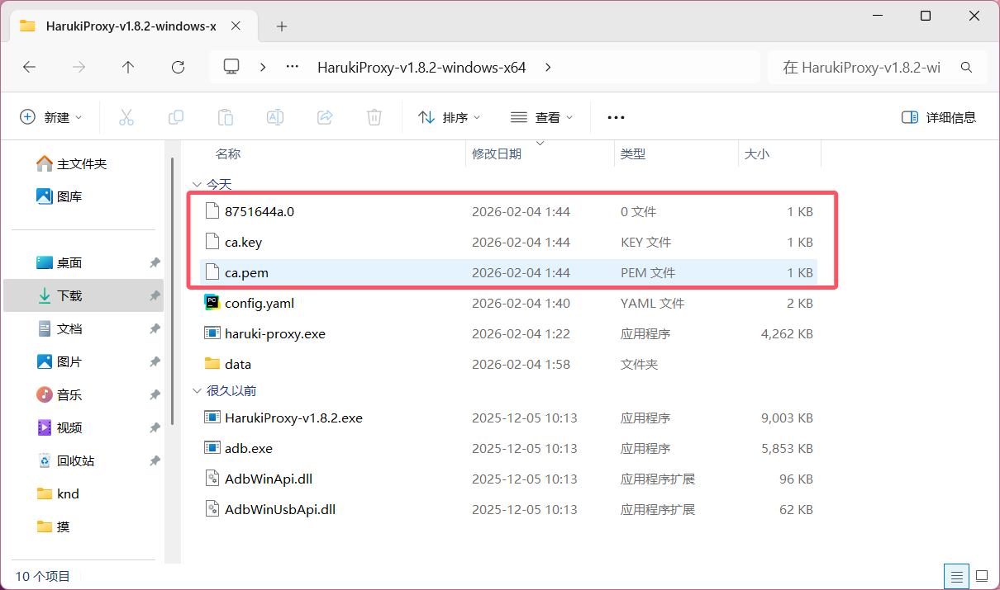

如果你是不是模拟器用户，而是Android实体设备用户，请转至 [HarukiProxy-Android教程](./android.md)
:::

::: info 特别鸣谢
开发者: [Haruki Dev Team](https://github.com/Team-Haruki)  
教程编写者: `storyxy3`、`Deseer`、`Aposetles` 和 `Lemoe`
:::

## 什么是HarukiProxy

HarukiProxy是由 [Haruki Dev Team](https://github.com/Team-Haruki) 开发的一款Android平台**半自动**抓取游戏pjsk的数据的程序。

## HarukiProxy的特点

- 支持 `日服`、`台服`、`韩服`、`国际服` 数据抓取
- 支持**自动上传数据**到Haruki工具箱
- 支持选择是否公开自己自动上传到Haruki工具箱的数据在公开API访问
- 支持自定义上传数据端点 (需第三方服务支持)
- 支持保存抓取的数据到本地
- 支持保存抓取的suite数据到本地
- 支持保存抓取的mysekai数据到本地
- 支持**自动操作MuMu模拟器完成配置**
- 支持自动配置**MuMu模拟器**或为其他可Root和可写系统盘的Android设备/模拟器安装MitM证书
- 支持adb自动操作**多个**Android设备
- 支持自动为Android设备设置HarukiProxy为代理
- 支持自定义上游HTTP代理

## 初期准备

::: danger 阅读前注意
**本程序自动化功能仅针对MuMu模拟器或其他可手动获取root可写系统盘的设备**

**Windows的MuMu模拟器版本需要V4.0.0.3179及以上版本才可使用HarukiProxy自动配置MuMu功能。如果你的MuMu版本不符合要求，请先升级**

**如果你的Android手机正在使用Magisk/KernelSU等程序，请搜索"Always Trust User Certs"获取详细教程，本文不再赘述**
:::

::: tip 提醒
配置出现问题时请跳转至 [问题自查](#问题自查)

先查找是否为常见问题，再借助搜素引擎和ai尝试解决问题，最后再在群聊里问群友，不会提问的请务必先阅读 [提问的智慧](https://github.com/ryanhanwu/How-To-Ask-Questions-The-Smart-Way/blob/main/README-zh_CN.md)
:::

根据你的系统，下载最新版的HarukiProxy。

下载完成后，将压缩包放至自己喜欢的目录，然后进行解压。

::: danger 注意
**请不要使用系统自带的解压方式！！！由于会产生很多不必要的问题，这里极度建议下载一个解压软件对压缩包进行解压**

**本文推荐使用7-zip 官网地址：<https://www.7-zip.org/>**
:::

解压后，目录应该有如下文件：

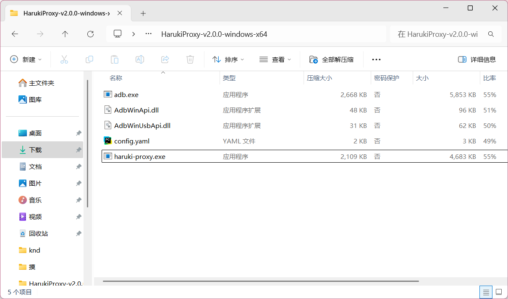

```
目录名：HarukiProxy-vx.x.x-windows-x64
adb.exe
AdbWinApi.dll
AdbWinUsbApi.dll
config.yaml
haruki-proxy.exe
如果没有开启查看后缀名，可能会看不到.后的内容
```

::: tip 提醒
如果你的系统不是Windows，请自行准备adb工具，并且添加到环境变量里
:::

### 配置config.yaml

推荐使用 `vscode` 等专业编辑器进行配置，记事本也可以使用，但有可能出错。

打开文件后，默认配置应该如下：

```yaml
auto_upload: true # 是否自动上传数据到Haruki Toolbox，一般不需要改为false
upload_endpoint: "" # 自定义上传数据端点
disable_encryption: false # 自定义上传数据端点需要将这个改为true，否则上传的数据无法解密
upload_secret: "" # 自定义上传端点用的私钥
save_data_locally: false # 是否自动保存数据到本地，如果你有需求可以改为true
save_data_dir: "./data" # 自动保存的数据路径
save_suite_locally: true # 是否自动保存suite数据到本地，如果save_data_locally未启用，则该选项不会生效
save_mysekai_locally: true # 是否自动保存mysekai数据到本地，如果save_data_locally未启用，则该选项不会生效
listen: "0.0.0.0:8888" # MitM监听，一般情况下无需更改
adb: true # 是否启用 ADB
auto_install_cert: true # 是否自动通过adb安装证书，如果使用的不是MuMu模拟器可以设置为false
android_proxy_ip: "" # 手动设置代理IP，如果自动获取IP并设置会导致模拟器/设备无法联网，请填写此项
goproxy_debug: false # 启用调试模式，如果有问题时请改为true，否则保持false即可
goproxy_upstream_proxy: "" # 上游代理，如果连接状况不佳可以设置(如"http://127.0.0.1:6152")，否则留空即可

# 自动控制MuMu选项
auto_mumu: true # 设置true为启动MuMu全自动操作
mumu_manager_path: "C:\\Program Files\\Netease\\MuMuPlayer-12.0\\nx_main\\MuMuManager.exe" # (Windows) MuMuManager的可执行文件地址，如果你的MuMu模拟器安装在C盘则不需要修改，否则需要修改
mumu_tool_path: "/Applications/MuMuPlayer.app/Contents/MacOS/mumutool" # (macOS) mumutool的可执行文件地址
auto_mumu_devices:
  - "0" # 你需要自动操作的MuMu模拟器编号
  # - "1" 可以添加
  # - "2" 更多设备
  # - "3" 支持批量操作
  # - "4" MuMu

# ADB 控制 Android 设备列表
devices:
  # - serial: "" # 有线连接的Android设备名
  #  wireless: "127.0.0.1:16384" # 无线连接的Android设备名（IP:端口）

  # 可继续添加更多设备
  # - serial: "device_serial"
  #   wireless: "ip:port"
```

#### 主要配置

修改：

```yaml
mumu_manager_path: "C:\\Program Files\\Netease\\MuMuPlayer-12.0\\nx_main\\MuMuManager.exe"
```

请将这里设置为你的实际 `MuMuManager.exe` 所在位置，如果你并不知道自己的程序所在位置，请执行以下流程：

1. 按理来说，在安装时mumu模拟器会自动在你的桌面创建一个快捷方式,如果你删除了这个快捷方式，那么请查看结尾的处理方式
   
   

2. 接下来，右键这个快捷方式，并在接下来弹出的菜单中选择"打开文件所在的位置"
   
   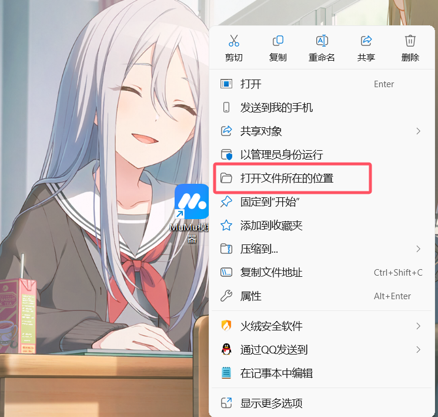
   
   接下来你就会跳转到mumu模拟器安装的目录,系统会用蓝色标识出快捷方式连接到的"MuMuNxMain.exe"
   
   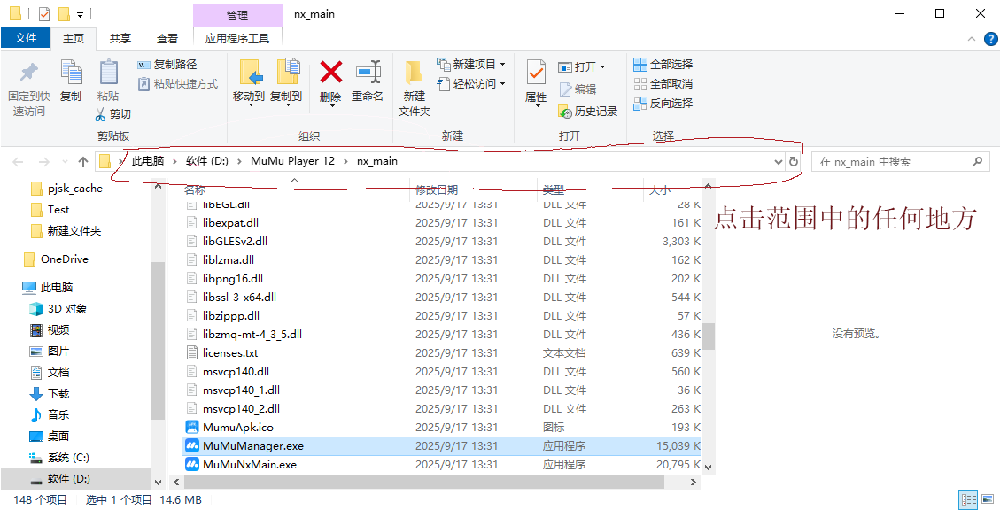

   我们的目标是在它上面的 `MuMuManager.exe`，接着左键上方的目录，然后按ctrl+c来复制目录。

   接下来，对于你复制的这个目录，我们有两种修改方法，同时我们要在结尾加入 `MuMuManager.exe`。

   例如在本例中，我复制到的地址为：

```
D:\MuMu Player 12\nx_main
```

你可以将里面的所有 `\` 修改为 `/`，然后加上 `MuMuManager.exe`，也就是：

```
D:/MuMu Player 12/nx_main/MuMuManager.exe
```

又或者将所有的 `\` 变成 `\\`，然后加上 `MuMuManager.exe`，也就是：

```
D:\\MuMu Player 12\\nx_main\\MuMuManager.exe
```

3. 打开你的MuMu模拟器，在你的虚拟机左上角，应该会有一个#x的编号
   
   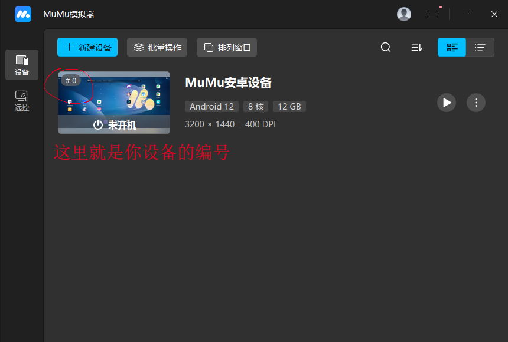
   
   将：

```yaml
auto_mumu_devices:
  - "0" # 你需要自动操作的MuMu模拟器编号
```

中的0改为实际编号（如果你也是0就不用改），同时如果你的MuMu中只有一台设备，那么请一定要确认为0。

#### 另一种找到目录的方式

如果你真的把桌面上MuMu模拟器的快捷方式删掉了，又或者说你的桌面上真的没有出现过这个快捷方式，那么就用接下来的方法吧：

1. 单击键盘上的windows键，这时候你的开始菜单应该弹出来了
   
   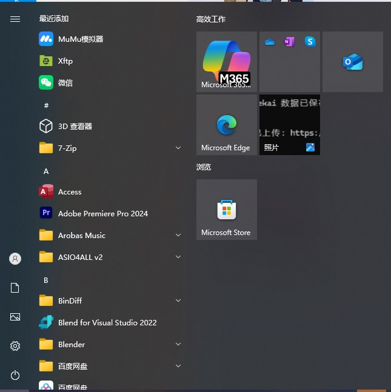
   
   接下来一路下滑这个菜单到"M"类(或者你点击最近添加，#或者ABCDE这堆字母的其中一个，会出现一个检索目录，直接点击里面的M)，应该会有一个MuMu模拟器文件夹。点进去，右键MuMu模拟器，接着在弹出的菜单中选择更多，再选择打开文件位置。现在我们只是来到了一个中转站，你还要再右键那个叫做MuMu模拟器的快捷方式，点击打开文件所在的位置，才能进入安装目录。
   
   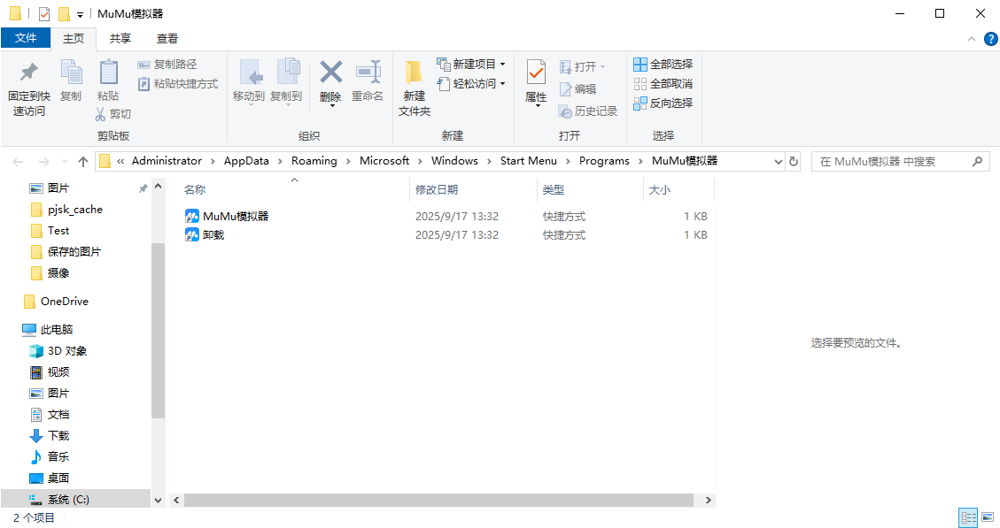

2. 如果你的操作系统宣称自己比较先进（是 `win11`）那么你就只能使用搜索了（虽然这个win10也一样可以用），直接点击任务栏里那个神秘放大镜进入搜索菜单，搜索MuMu模拟器，然后直接点击打开文件位置，和之前一样操作。
   
   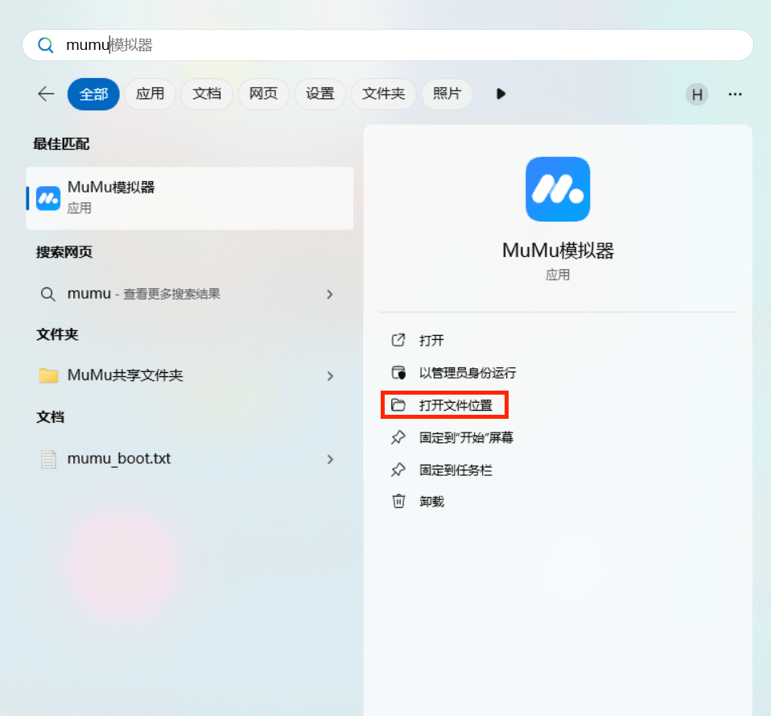
   
   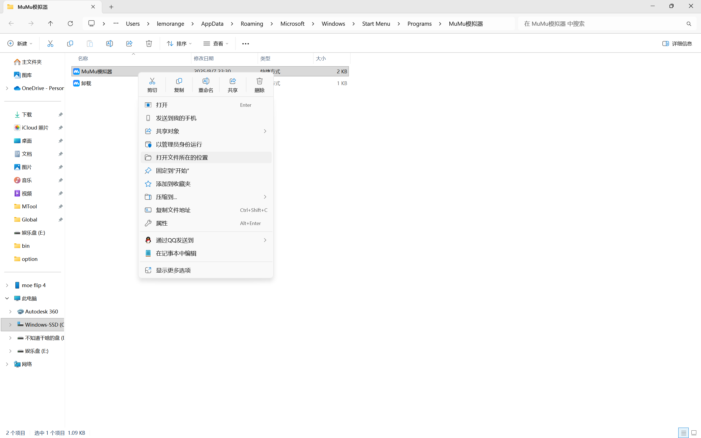

#### 其他配置

- `save_data_locally: false` - 是否自动保存数据到本地，如果你有需求可以改为true
- `save_data_dir: "./data"` - 自动保存的数据路径，默认为在HarukiProxy安装目录下的data文件夹
- `save_suite_locally: true` - 是否自动保存suite数据到本地，如果 `save_data_locally` 未启用，则该选项不会生效
- `save_mysekai_locally: true` - 是否自动保存mysekai数据到本地，如果 `save_data_locally` 未启用，则该选项不会生效

  这一部分控制你是否将抓取到的数据保存在本地，如果你想要查看自己的suite与mysekai数据，抑或是想要手动上传数据，那么就将 `save_data_locally: false` 改为 `true`，数据则会自动保存在你HarukiProxy目录下的data目录。

- `goproxy_upstream_proxy: ""` - 上游代理，如果连接状况不佳可以设置(如 `http://127.0.0.1:6152`)，否则留空即可

  如果你不是很清楚代理是什么意思，那么不用管了，否则和注释一样，将6152改为你代理软件中找到的端口号。

- `upload_endpoint: ""` - 自定义上传数据端点，不修改则默认上传至haruki toolbox的数据上传端点，你可以修改为想传到的其他端点地址
- `disable_encryption: false` - 如果你需要自定义上传数据端点，必须把这个改为true，否则上传的数据对方无法读取
- `upload_secret: ""` - 自定义上传端点用的私钥，如果你需要上传的端点有要求的话填写即可

::: danger 注意
记得按下 Ctrl+S 来保存你所做的更改
:::

#### 在MuMu上要干的事情

在你的MuMu模拟器上下载你要抓包的服务器版本，随后和你之前做过的一样进入游戏下载数据，进入游戏，确认自己能够进入游戏主界面后我们便完成了准备工作。

**请注意，如果你在这个阶段无法连接游戏服务器或者下载数据过慢，可以点击 `...` 选择游戏加速功能，里面有UU加速器可供使用。**

## 开始使用HarukiProxy

::: danger 注意
**如果你前面使用了MuMu模拟器自带的游戏加速功能，或是你自己在模拟器里使用了什么加速器，这时都该关掉了，不然接下来会抓取不到数据**
:::

::: danger 注意
如果你正在使用Mac版本的MuMu，请务必**先打开MuMu模拟器**，否则无法使用mumutool进行自动化控制
:::

现在回到解压HarukiProxy的目录，双击 `haruki-proxy.exe` 来打开。

还有另外一种更加建议的方式，使用CMD来打开。

在资源管理器的HarukiProxy安装目录中，点击上方的目录框，删除当前目录路径后，输入 `cmd`，接着按回车。

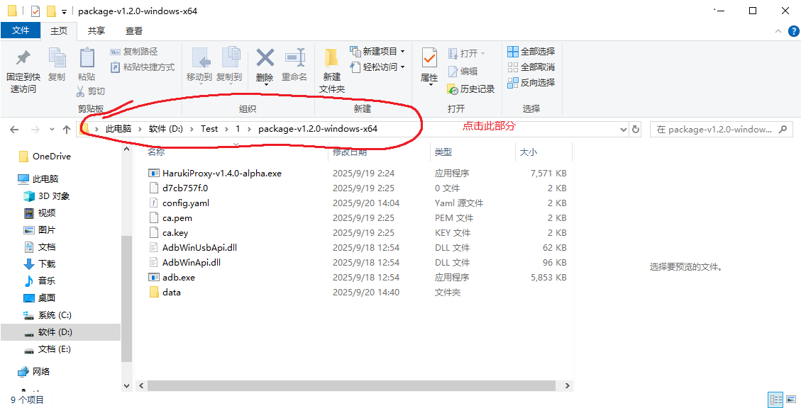

在随后弹出的CMD中，输入：

```
haruki-proxy.exe
```

（可以在输入了前几个字符后按下Tab自动补全）

然后按回车来启动HarukiProxy。

过程中如果看到MuMu模拟器自动重启，属于完全正常现象，请不用管这些，只要看终端就好了。

如果提示WindowsDefender提示已阻止haruki-proxy.exe的部分功能，请点击下方的允许。

如果遇到了：

```
[WARNING][HarukiProxyMain] 批量设置MuMu模拟器代理错误: exit status 1
```

这是偶发性问题，请 Ctrl+C 退出HarukiProxy后重新启动。

正常没有错误的初次启动大概为下图：

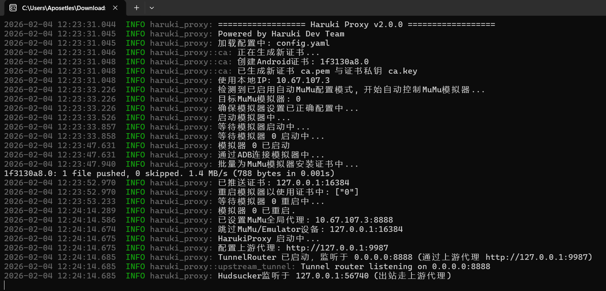

## 抓取

接着启动你的世界计划客户端。

随后出现一些开头为WARN的消息，如果格式为Cannot read TLS response那就是正常现象，接着可以抓取了。

### suite数据

在登录界面进行登录操作后可以抓取，下图为成功提示：

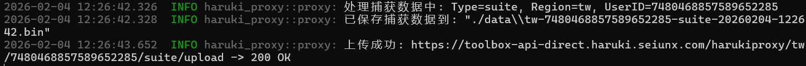

### mysekai数据

打开mysekai，等到你的豆腐人走出房门，看到如下提示，那么Mysekai数据抓取就顺利完成了：

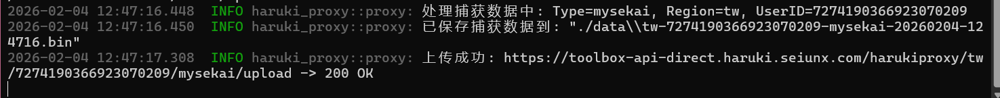

或者使用msa或者msm进行测试是否抓包成功。

::: tip 提醒
如果遇到bot"你上传的MySekai数据里没有正确的数据哦。"，请去编队随便交换个人再进入烤森抓包
:::

---

## 问题自查

如果在执行文档中的教程时出现问题时，请先查阅此部分进行修复。

### 程序闪退

1. 按下键盘上的 `Win + R` 键，会弹出一个"运行"对话框。在里面输入 `cmd`，然后按回车。
2. 在.exe 文件的文件夹上方的地址栏上单击地址栏，路径就会被完整选中，右键点击选中的路径，选择"复制"
3. 在命令行中输入 `cd`，然后加一个空格，再按 `Ctrl+V` 粘贴你刚刚复制的路径，最后按回车，可以看到命令行中的路径现在和你的程序所在路径一致
4. 输入 `haruki-proxy` 后按tab可以发现会补全为你下载版本的 `haruki-proxy.exe`，回车即可以运行
5. 你现在可以看到具体的报错，把它复制到浏览器查阅或者询问ai

### 默认ip配置失效

```yaml
android_proxy_ip: "" # 手动设置代理IP，如果自动获取IP并设置会导致模拟器/设备无法联网，请填写此项
```

请将你正在操作的这台电脑（抑或是其它设备，总之是你要运行MuMu模拟器和HarukiProxy的这台设备）的ip地址填入 `""` 中。

如果你不知道自己的ip地址的话，请按照以下流程：

- Windows：同时按下键盘上的 WIN+R 两个键，右下角会弹出"运行"窗口，在窗口中输入cmd并回车

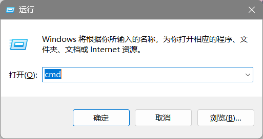

接着，在弹出的界面中输入 `ipconfig`，从出现的内容中找到 `以太网适配器 以太网` 或 `无线局域网适配器 WLAN`，下方的IPV4/IPV6地址即为你的当前地址。

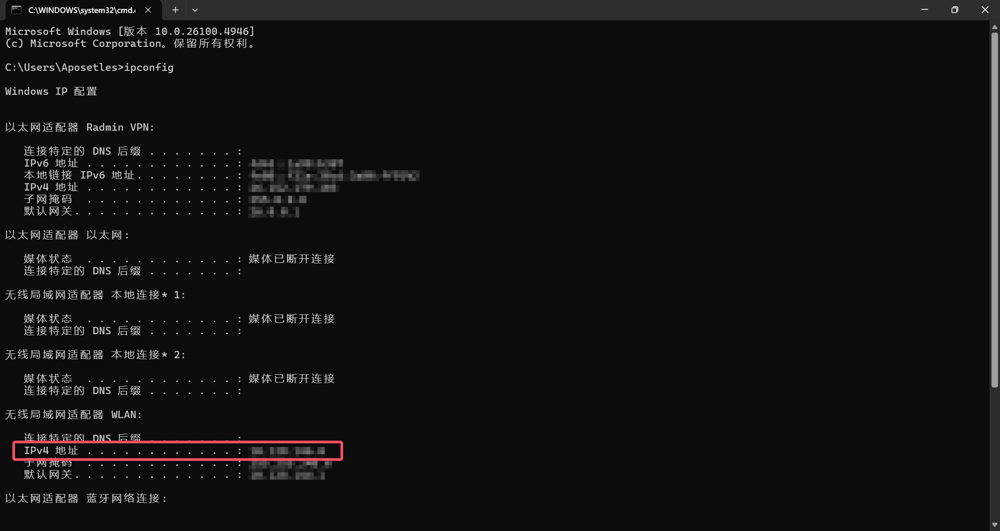

### 模拟器连不上网

当你使用HarukiProxy完成抓包后，如果模拟器没能正常联网：

- **对于使用MuMu模拟器的用户**

  只需要**重启**一次HarukiProxy，等待GoProxy代理启动之后，**按Ctrl+C终止**HarukiProxy即可。

- **对于使用adb连接其他设备的用户**

  进入CMD(在文章的确认主机IP已提到过)，之后在终端输入：
  
  ```
  adb -s 127.0.0.1:16384 shell settings put global http_proxy :0
  ```
  
  将 `127.0.0.1:16384` 替换为自己的设备。

### config.yaml配置相关

#### 配置了上游代理后闪退

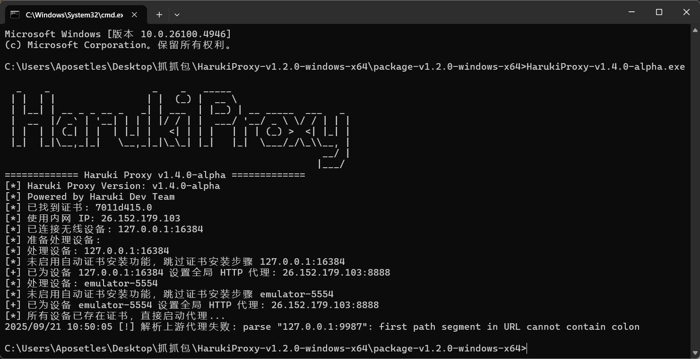

请查找：

```yaml
goproxy_upstream_proxy: ""
```

中的配置是否为 `http://127.0.0.1:xxxx` 的形式，可能会遗漏 `http://`。

#### 配置文件发生错误

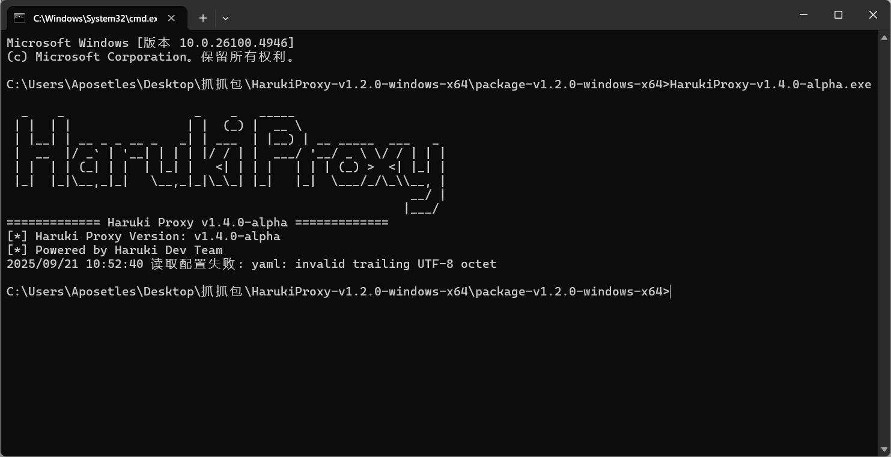

也许在你确认了全部的配置都没有问题保存后，可能还会遇到编码问题，我们的配置文件使用的是标准的UTF-8编码，因此使用其它方式（如使用记事本）编码后得到的配置文件会发生编码错误。

最好的处理办法就是重新拿一份配置文件，更改你的记事本编码方式或者使用专业编辑器（如VSCode）编辑，然后用正确的编码方式保存。