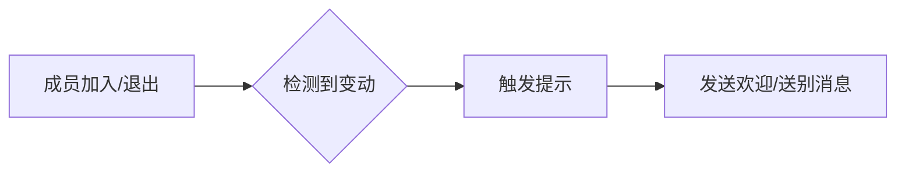

# 入群/退群提示 <Badge type="info" text="自动" />

## 📖 功能简介

自动检测群成员变动并发送**欢迎/送别消息**，让群管理更加温馨和专业。

::: info ✨ 核心功能
- 👋 **入群欢迎** — 新成员加入时发送欢迎消息
- 👋 **退群送别** — 成员离开时发送送别提示
:::

## ⚙️ 功能说明

### 功能特性

| 场景 | 触发条件 | 发送内容 |
| :--- | :--- | :--- |
| 新成员入群 | 检测到新成员加入 | 欢迎消息 |
| 成员主动退群 | 检测到成员退出 | 送别消息 |
| 成员被踢出 | 检测到成员移除 | 系统提示 |

## 🎮 效果展示

